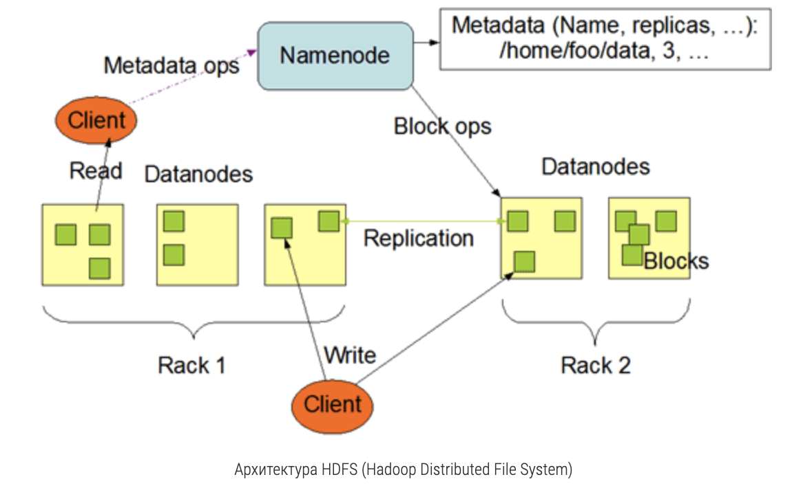

# Botify

Сервис рекомендаций реализован как приложение на [Flask](https://flask-restful.readthedocs.io/en/latest/).
Это приложение умеет обрабатывать запросы по REST API.
В качестве in-memory кэша используется [Redis](https://redis.io/).
Приложение пишет лог событий в json в папку `/app/log/`


## Инструкция

1. [Устанавливаем docker](https://www.docker.com/products/docker-desktop)
2. Собираем образы и запускаем контейнеры
   ```
   docker-compose up -d --build 
   ```   
3. Смотрим логи рекомендера
   ```
   docker logs recommender-container
   ```
4. Останавливаем контейнеры
   ```
   docker-compose stop
   ```
6. Модифицируем код в этом модуле
7. Повторяем шаги 2-4, пока не достигнем поставленной цели 

## Полезные команды
Проверяем, что сервис жив
```
curl http://localhost:5000/
```
Запрашиваем информацию по треку
```
curl http://localhost:5000/track/42
```
Запрашиваем следующий трек
```
curl -H "Content-Type: application/json" -X POST -d '{"track":10,"time":0.3}'  http://localhost:5000/next/1
```
Завершаем пользовательскую сессию
```
curl -H "Content-Type: application/json" -X POST -d '{"track":10,"time":0.3}'  http://localhost:5000/last/1
```
Скачиваем логи сессий
```
docker cp recommender-container:/app/log/ /tmp/
```

## Работа на удаленном сервере
Заходим на сервер по ssh, прокидываем порт
```
ssh -L 16006:127.0.0.1:30006 dnikanorova@mipt-client.atp-fivt.org
```
Посмотреть, какие порты заняты
```
ss -tulpn
```
Создаем директорию для jupyter ноутбуков
```
mkdir jupyter
```
Отправляем файлы с локальной машины на удаленный сервер
```
scp jupyter/Week1Seminar.ipynb dnikanorova@mipt-client.atp-fivt.org:jupyter
```
Стартуем ноутбук
```
export PYSPARK_DRIVER_PYTHON=jupyter
export PYSPARK_PYTHON=/usr/bin/python3
export PYSPARK_DRIVER_PYTHON_OPTS='notebook --ip="*" --port=30006 --no-browser'
pyspark2 --master=yarn --num-executors=2
```
Открываем ноутбук на локальном хосте
```
http://localhost:16006/
```
## Работа на кластере HDFS

Закидываем логи контейнера в hdfs (папка script должна быть в $PYTHONPATH). 
Программа dataclient.py отправляет данные в папку юзера: /user/dnikanorova/
```
python dataclient.py --user dnikanorova log2hdfs --cleanup my_remote_dir
```
Проверяем содержимое папки в hdfs
```
hadoop fs -ls /user/dnikanorova/my_remote_dir
```
Смотрим размер файлов в директории
```
hadoop fs -du -h /user/dnikanorova/my_remote_dir
```